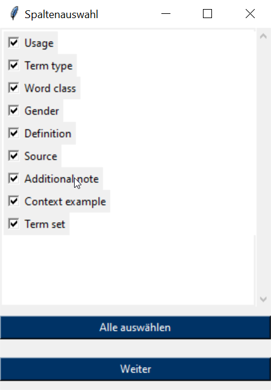

<pre align="center">

  _____  ____ __  __  _           _   _  _____  __  __  _     
 |_   _|| __ )\ \/ / | |_  ___   | | | ||_   _||  \/  || |    
   | |  |  _ \ \  /  | __|/ _ \  | |_| |  | |  | |\/| || |    
   | |  | |_) |/  \  | |_| (_) | |  _  |  | |  | |  | || |___ 
   |_|  |____//_/\_\  \__|\___/  |_| |_|  |_|  |_|  |_||_____|
                                                              
  

Converter for TBX-files to HTML

</pre>

## Übersicht / Overview
**TBX to HTML** converts TBX files into readable HTML files. It analyzes the TBX file and allows you to select the desired columns for conversion.

## Installation
No installation is required. Simply use the **tbx_to_html.exe** file from the "MVP" folder to start the tool.

## Usage
1. open the program:
       Open the "TBX to HTML" program.
2. select a TBX file:

- Click on the "Select file" button. (1)
- Select the desired TBX file from your file system and confirm the selection with "Open".

3. column selection:

- After selecting the file, a window opens to select the columns to be displayed in the HTML document.
- You can select the columns by activating the corresponding checkboxes.
- Alternatively, you can also use the "Select all" option to select all available columns at once (recommended).
- Click on "Next" to continue.

4. conversion:

- After the column selection, the TBX file is converted into an HTML document.
- After successful conversion, the HTML is saved in the same directory as the original TBX file. The file is called "terminology_YYYY-MM-DD", whereby the current day is taken as the date.

5. close the program:
       Once the conversion is complete, you can close the program by clicking on the "Close program" button (2).

## Support
If you have questions or problems, contact me here on GitHub. :)

