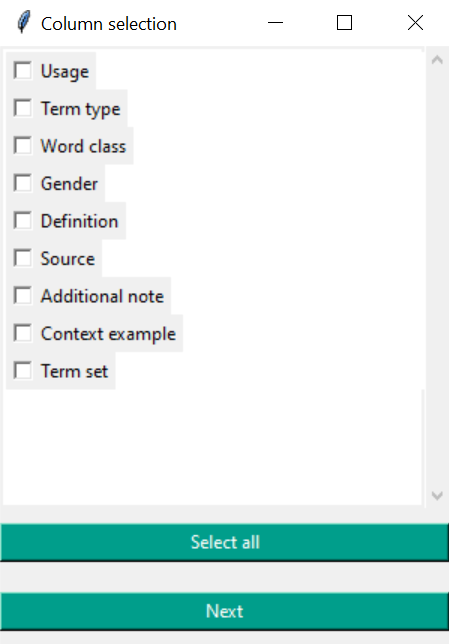

<div align="center">
<pre>
  _____  ____ __  __  _           _   _  _____  __  __  _     
 |_   _|| __ )\ \/ / | |_  ___   | | | ||_   _||  \/  || |    
   | |  |  _ \ \  /  | __|/ _ \  | |_| |  | |  | |\/| || |    
   | |  | |_) |/  \  | |_| (_) | |  _  |  | |  | |  | || |___ 
   |_|  |____//_/\_\  \__|\___/  |_| |_|  |_|  |_|  |_||_____|
                                                              
<br>
Welcome to the TBX to HTML Converter! 🎉 This handy tool takes your TBX files
and transforms them into beautiful, readable HTML files. Whether you're a terminology
enthusiast or just someone who loves well-organized data, this tool is here to make your
life easier.
</pre>
</div>

> Note: This tool has been tested using a terminology export from the tool SMC (Smart Media Creator) by ECS (Expert Communication Solutions).


## Overview
**TBX to HTML** converts TBX files into readable HTML files. It analyzes the TBX file and allows you to select the desired columns for conversion.


## Installation
No installation is required. Simply download the folder **TBX_to_HTML_compiled** and open the file **TBX_to_HTML.exe** or use the single file **TBX_to_HTML (single file).exe** to start the tool.
> ⚠️ **Warning:** I am not licensed by Microsoft, so you might encounter an warning message related to licensing.


## Usage
1. open the program:
2. select a TBX file:


- Click on the "Select file" button.
- Select the desired TBX file from your file system and confirm the selection with "Open".

3. column selection:



- After selecting the file, a window opens to select the columns to be displayed in the HTML document.
- You can select the columns by activating the corresponding checkboxes.
- Alternatively, you can also use the "Select all" option to select all available columns at once (recommended).
- Click on "Next" to continue.

4. conversion:


- After the column selection, the TBX file is converted into an HTML document.
- After successful conversion, the HTML is saved in the same directory as the original TBX file. The file is called "terminology_YYYY-MM-DD", whereby the current day is taken as the date.

5. close the program:
       Once the conversion is complete, you can close the program by clicking on red the "Close" button.


## How This Tool Works
This tool  is a Python program that facilitates the conversion of a TBX (TermBase eXchange) file to an HTML format. The program also includes features for previewing and selecting specific columns from the TBX file. The code is divided into two parts, each responsible for different functionalities. Here is a detailed explanation of how the script works:


### Part 1: GUI Setup and TBX File Processing
#### Importing Libraries

```python
   import tkinter as tk
   from tkinter import filedialog
   import xml.etree.ElementTree as ET
   from datetime import datetime
```
The script imports necessary libraries for GUI creation (tkinter), file handling (filedialog), XML parsing (ElementTree), and date/time operations (datetime).

#### ScrollableFrame Class

```python
   class ScrollableFrame(tk.Frame):
    # Klasse für ein scrollbares Frame in der Gui
    def __init__(self, master, **kwargs):
        tk.Frame.__init__(self, master, **kwargs)
        ...
```
This class creates a scrollable frame in the GUI that allows the user to navigate through multiple checkboxes for column selection and easily add new columns if necessary.

#### Function to Convert TBX to HTML

```python
   def convert_tbx_to_html(tbx_file_path, html_file_path, selected_columns):
    ...
```
This function parses the TBX file and converts its content to an HTML file, including only the selected columns. It constructs an HTML structure with tables and other HTML elements.

#### Function to Preview Columns

```python
   def preview_columns(file_path, selected_columns):
    ...
```
This function reads the TBX file to identify and preview available columns. It returns a list of columns present in the file.

#### Function to Choose File

```python
   def choose_file():
    ...
```
This function displays a GUI window with checkboxes for each column, allowing the user to select which columns to include in the HTML conversion.

#### GUI Main Window

```python
   root = tk.Tk()
   root.title("Termfinder by User Assistance")
   root.geometry("500x150")
   ...
   root.mainloop()
```
This section sets up the main GUI window with buttons to choose a file and close the program. It also includes a label for informational text.


### Part 2: JavaScript for Enhanced HTML Functionality
The generated HTML file includes embedded JavaScript to provide interactive features such as filtering, toggling between languages, tooltips, and converting URLs to links.

#### Autocomplete Suggestions

```js
   var autocompleteInput = document.getElementById('searchInput');
   if (suggestions.length > 0) {
      autocompleteInput.placeholder = suggestions[0].substring(filter.length);
   } else {
      autocompleteInput.placeholder = '';
   }
```
This section of the code dynamically updates the placeholder text in the input field based on the user's input. It shows autocomplete suggestions by displaying the first suggestion that matches the input, helping users to quickly find relevant terms.

#### Window Onload Event

```js
   window.onload = function() {
    filterTable();
    toggleTable();
    addTooltipsFromTable();
    convertUrlsToLinks();
}
```
The window.onload event ensures that certain functions are executed only after the entire webpage has finished loading. This includes filtering the table, toggling the table language, adding tooltips, and converting URLs into clickable links.

#### Filter Table Function

```js
   function filterTable() {
    var selectedLanguage = document.getElementById("languageSelect").value.toUpperCase();
    var selectedFilter = document.getElementById("filterSelect").value.toUpperCase();
    var table = document.getElementById("termTable");
    var rows = table.getElementsByTagName("tr");
    ...
```
The filterTable function filters the table rows based on the selected language and filter criteria. It retrieves the selected values from dropdowns and compares them with the table data, showing only the rows that match the criteria and hiding the others.

#### Toggle Table Function

```js
   function toggleTable() {
    var germanTable = document.getElementById('german-table');
    var englishTable = document.getElementById('english-table');
    ...
```
The toggleTable function switches between displaying the German and English versions of the table. It checks the state of a checkbox and toggles the visibility of the respective tables accordingly, allowing users to view the information in their preferred language.

#### Tooltips Function

```js
   function addTooltipsFromTable() {
    var tooltipTable = [
        ["Hauptbenennung", "Main term designation", "This is the main term designation."],
        ...
    ];
    ...
```
The addTooltipsFromTable function adds tooltips to table cells based on predefined terms. It searches for specific terms in the table and, if found, attaches a tooltip to the cell to provide additional context or explanation, enhancing user understanding.

#### Convert URLs to Links

```js
function convertUrlsToLinks() {
    var table = document.getElementById("termTable");

    if (table) {
        for (var i = 0; i < table.rows.length; i++) {
            for (var j = 0; j < table.rows[i].cells.length; j++) {
                var cellContent = table.rows[i].cells[j].innerHTML;
    ...
```
The convertUrlsToLinks function scans the table for any cells containing URLs and converts these URLs into clickable links. This function also handles special cases where URLs are followed by "(translation)" text, ensuring the content is properly formatted and interactive. **That was a customer requirement! If there are no ("translation") strings in the cells, the part can be deleted.**

Steps:
1. The convertUrlsToLinks function is defined.
2. It retrieves the HTML table with the ID "termTable" using document.getElementById.
3. If the table is found, it iterates over each row in the table.
4. For each row, it iterates over each cell in the row.
5. It retrieves the content of the current cell using cells[j].innerHTML.
6. It uses a regular expression to match URLs in the cell content.
7. If a URL match is found and the cell does not contain the text "(übersetzung)", it creates a new link element (<a>) and sets its href, textContent, and target attributes.
8. It extracts the remaining text after the URL and creates a text node for it.
9. If there is content before the URL, it creates a text node for it as well.
10. It clears the cell content and appends the text nodes and the link element.
11. If the cell content contains the text "(translation)", it splits the content at "(translation)" and creates a new link element for the part before it.
12. It creates a text node for the part after "(translation)" and sets the cell content to the link element and the text node.
13. If the table is not found, it logs an error message to the console.


#### Table Header "sticky"

```js
document.addEventListener('DOMContentLoaded', function() {
            var tableHeaders = document.querySelectorAll('#termTable th');
            tableHeaders.forEach(function(th) {
                th.style.position = 'sticky';
                th.style.top = '0';
                th.style.zIndex = '1000';
            });
        });
```

1. **document.addEventListener('DOMContentLoaded', function() {...});**: This binds a function to the 'DOMContentLoaded' event of the document. This function is executed when the entire HTML document has been fully loaded and parsed.

2. **var tableHeaders = document.querySelectorAll('#termTable th');**: This selects all 'th' elements that are within an element with the ID 'termTable'. 'querySelectorAll' returns a NodeList containing all matching elements.

3. **tableHeaders.forEach(function(th) {...});**: This iterates through each element in the 'tableHeaders' NodeList and executes a function for each element.

4. **th.style.position = 'sticky';**: Sets the CSS position of the current 'th' element to 'sticky', which causes it to stick to the screen when scrolling.

5. **th.style.top = '0';**: Sets the distance of the current 'th' element from the top to '0', which ensures that it always remains at the top of the screen when it is stuck.

6. **th.style.zIndex = '1000';**: Sets the stacking order of the current 'th' element to '1000', which ensures that it is displayed above other elements when it is pinned.

#### colorize the status of the term with colorizeTerms() function

```js
function colorizeTerms() {
        const table = document.getElementById('termtable');
        const rows = table.getElementsByTagName('tr');
    ...
```
The colorizeTerms() function searches an HTML table for specific terms and colors the corresponding cells based on the term found. The terms to be searched for are 'preferredTerm', 'deprecatedTerm' and 'admittedTerm', and each category is highlighted with a specific background and font color.

### HTML Structure
The generated HTML includes two tables (German and English) with relevant term data. It also includes interactive elements like a checkbox to toggle between languages, and dropdowns for filtering terms based on language and other criteria. The script ensures the HTML output is dynamic and user-friendly.


## Support
If you have questions or problems, contact me here on GitHub. :)
